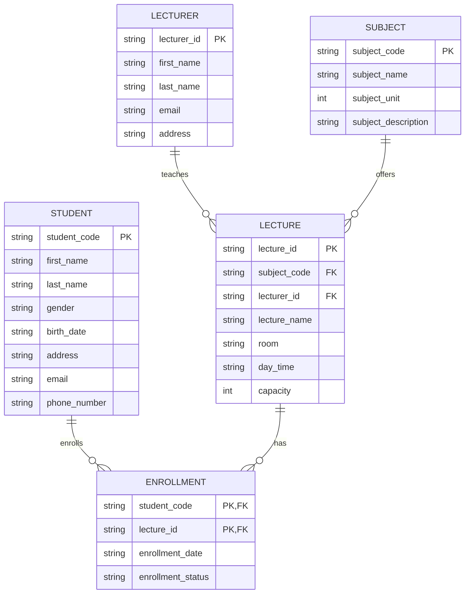

# ER Diagram — Student / Lecturer / Subject / Lecture / Enrollment

## Review notes (changes from the original draft)

The original draft (see `Week3/Activity-3/describe ER`) had a few issues that were
cleaned up before implementation:

1. **Enrollment had a duplicated/conflicting primary key** — `S_code` was marked PK
   and `student_code` appeared again as a separate field. Collapsed into a single
   composite primary key `(student_code, lecture_id)`. This also enforces the stated
   rule *"one student to one lecture per enrollment process"* at the schema level
   (no duplicate rows possible).
2. **Redundant attributes removed** — `Enrollment.Course_name`, `Enrollment.CC#`,
   `Lecture.Subject` (text) and `Lecture.CC#` all duplicated data already reachable
   through the `subject_code` / `lecture_id` foreign keys. Removed to keep the schema
   normalized (3NF).
3. **`Lecturer.subject_code` FK removed** — pinning a lecturer to a single subject
   contradicts the relationship description: *"Lecturers teach lectures for
   different subjects."* The subject a lecturer is associated with is now only
   determined indirectly, through the `Lecture` rows they teach (`Lecture.lecturer_id`
   + `Lecture.subject_code`), so one lecturer can legitimately teach lectures under
   several subjects.
4. **Naming standardized** to `snake_case`, and `subject_udsc` (unclear/likely typo)
   was renamed to `subject_description`.

## Entities & attributes

- **Student**(`student_code` PK, first_name, last_name, gender, birth_date, address, email, phone_number)
- **Lecturer**(`lecturer_id` PK, first_name, last_name, email, address)
- **Subject**(`subject_code` PK, subject_name, subject_unit, subject_description)
- **Lecture**(`lecture_id` PK, `subject_code` FK → Subject, `lecturer_id` FK → Lecturer, lecture_name, room, day_time, capacity)
- **Enrollment**(`student_code` FK → Student, `lecture_id` FK → Lecture, enrollment_date, enrollment_status) — PK is `(student_code, lecture_id)`

## Relationships

- **Enrolls**: Student —(M:N via Enrollment)— Lecture. A student can enroll in many
  lectures; a lecture can have many students. Each `(student, lecture)` pair is
  unique.
- **Teaches**: Lecturer —(1:M)— Lecture. Each lecture has exactly one lecturer; a
  lecturer can teach many lectures.
- **BelongsTo**: Subject —(1:M)— Lecture. Each lecture belongs to exactly one
  subject; a subject can have many lectures.

## Note on "course"

The assignment asks for "3 courses". In this schema a **Lecture** is the concrete,
enrollable offering of a **Subject** (what a student actually registers for), so
"course" in the sample data maps to `Lecture` — three lectures are seeded, one per
subject.
