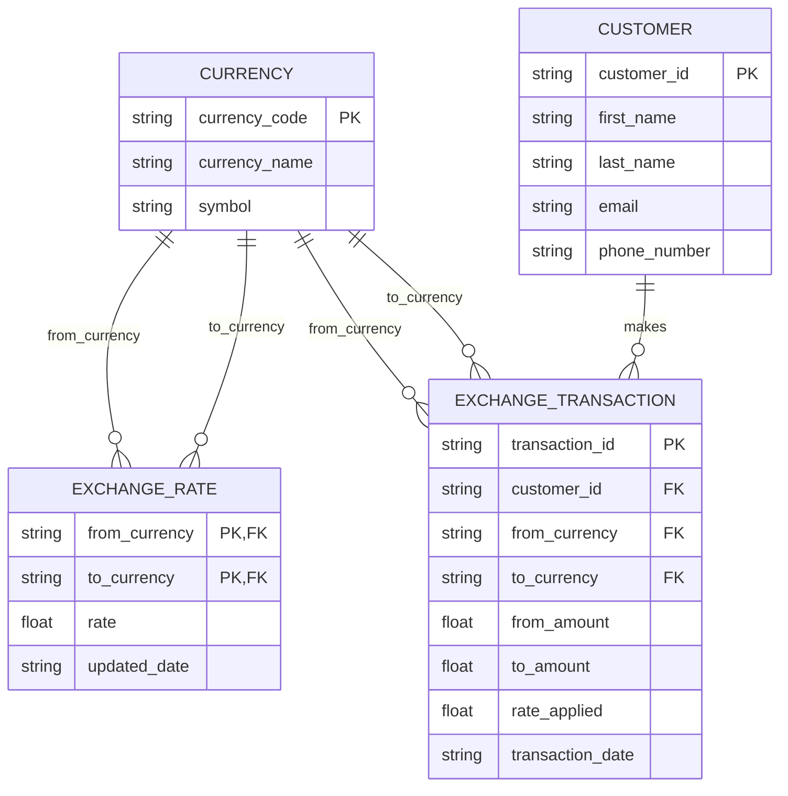

# ER Diagram — Currency / Customer / ExchangeRate / ExchangeTransaction

## Entities & attributes

- **Currency**(`currency_code` PK, currency_name, symbol)
- **Customer**(`customer_id` PK, first_name, last_name, email, phone_number)
- **ExchangeRate**(`from_currency` FK → Currency, `to_currency` FK → Currency, rate, updated_date) — PK is `(from_currency, to_currency)`
- **ExchangeTransaction**(`transaction_id` PK, `customer_id` FK → Customer, `from_currency` FK → Currency, `to_currency` FK → Currency, from_amount, to_amount, rate_applied, transaction_date)

## Relationships

- **Quotes**: Currency —(1:M)— ExchangeRate (twice — once as `from_currency`, once as
  `to_currency`). Each rate row converts exactly one currency pair; a currency can
  appear in many rate pairs.
- **Makes**: Customer —(1:M)— ExchangeTransaction. A customer can make many
  transactions; each transaction belongs to exactly one customer.
- **Converts**: Currency —(1:M)— ExchangeTransaction (twice — once as
  `from_currency`, once as `to_currency`). Each transaction converts exactly one
  currency into another; a currency can appear in many transactions on either side.

## Diagram

