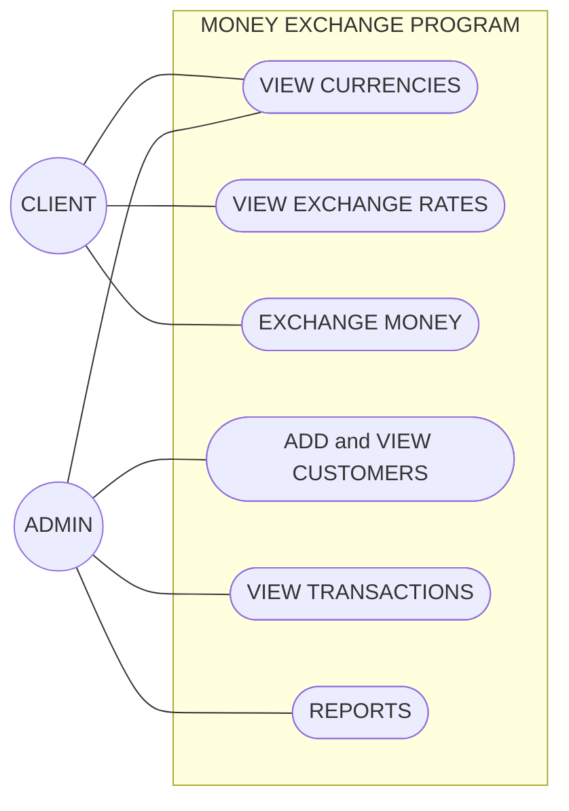

# Use Case Diagram — Money Exchange Program

```mermaid
flowchart LR
    Client((CLIENT))
    Admin((ADMIN))

    subgraph System["MONEY EXCHANGE PROGRAM"]
        direction TB
        UC1(["VIEW CURRENCIES"])
        UC2(["VIEW EXCHANGE RATES"])
        UC3(["EXCHANGE MONEY"])
        UC4(["ADD and VIEW CUSTOMERS"])
        UC5(["VIEW TRANSACTIONS"])
        UC6(["REPORTS"])
    end

    Client --- UC1
    Client --- UC2
    Client --- UC3

    Admin --- UC1
    Admin --- UC4
    Admin --- UC5
    Admin --- UC6
```
